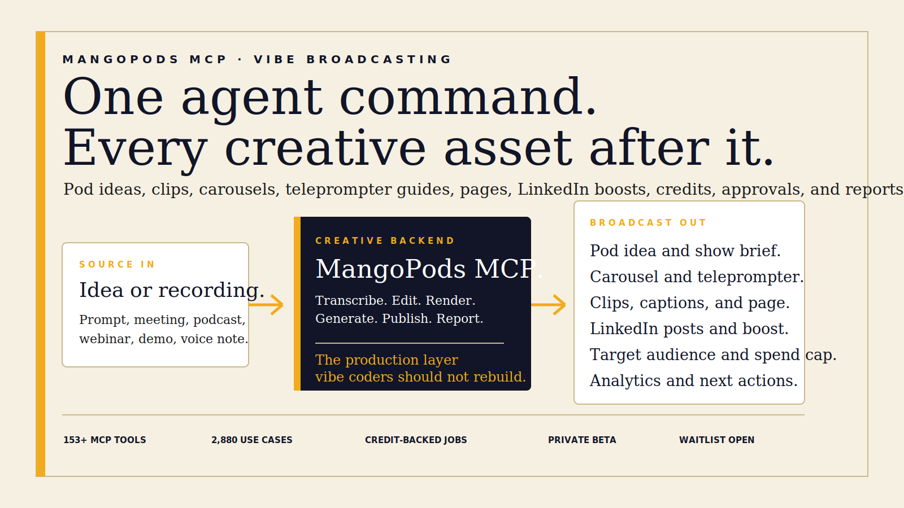
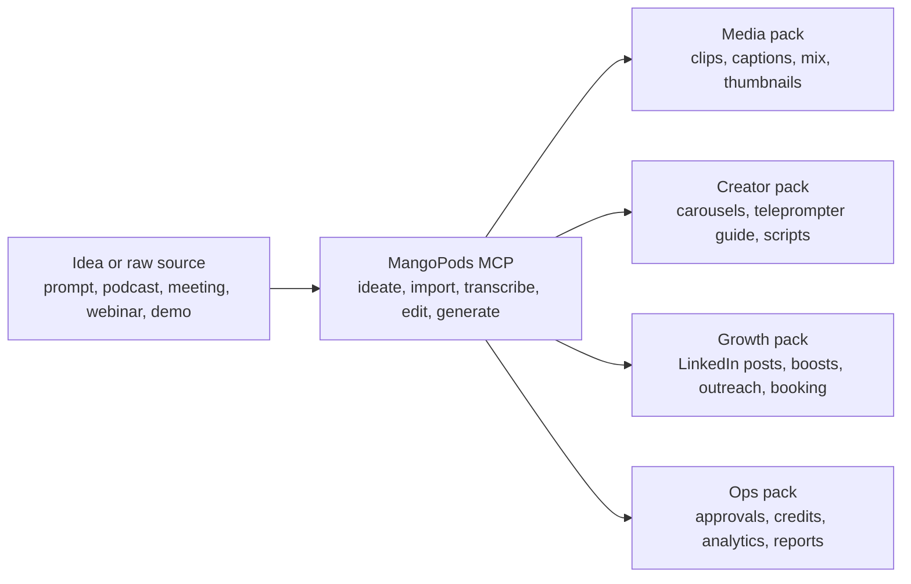

<p align="center">
  
</p>

<p align="center">
  <a href="https://mango-magic.github.io/mangopods-mcp/">Developer portal</a>
  ·
  <a href="https://docs.google.com/forms/d/e/1FAIpQLSckGZ6LHc7MkKo8aSdLpC1REH-2IxNgN4kgV8uus97JBy6GvQ/viewform?usp=publish-editor">Join the waitlist</a>
  ·
  <a href="docs/power-moves.md">Power moves</a>
  ·
  <a href="docs/agent-demo-prompts.md">Agent prompts</a>
</p>

<p align="center">
  
</p>

# MangoPods MCP.

The creative backend vibe coders have been trying to hallucinate.

MangoPods is a private MCP surface for the MangoMagic production engine. It lets agents turn an idea or source asset into the whole broadcast: pod ideas, carousels, teleprompter guides, edited podcasts, vertical clips, captions, thumbnails, landing pages, articles, social packs, LinkedIn demographic boosts, outreach, booking flows, approval queues, publishing, analytics, and credit-backed delivery.

This is not a video editing API.

This is a creative operating system exposed through MCP.

## The Category.

Most AI apps can write a caption. MangoPods is for the thing after the caption:

- the render that actually finishes
- the site that actually ships
- the clip pack with titles, captions, thumbnails, and exports
- the pod idea generator that creates carousels, teleprompter guides, hooks, and briefs before anything is uploaded
- the approval queue before a client sees it
- the credit estimate before expensive work starts
- the published page, scheduled posts, LinkedIn boost audience, guest kit, and report
- the next action after analytics comes back

Agents should not have to rebuild media infrastructure, publishing pipes, brand systems, rights logic, or billing rails. They should ask for the outcome and get durable assets back.

## One Idea Or Recording Becomes A Broadcast.



The simple demo is savage:

```json
{
  "tool": "recipe.run",
  "arguments": {
    "recipe": "episode_launch_pack",
    "source": "raw-founder-interview.mov",
    "brand_kit": "mangomagic",
    "outputs": [
      "full_podcast_mix",
      "12_vertical_clips",
      "caption_files",
      "carousel_pack",
      "teleprompter_guide",
      "episode_page",
      "linkedin_post_pack",
      "linkedin_targeted_boost_plan",
      "guest_share_kit",
      "spend_report"
    ],
    "audience": {
      "platform": "linkedin",
      "roles": ["founder", "head of marketing", "content lead"],
      "regions": ["Australia", "United States"],
      "company_size": "11-500"
    },
    "approval_mode": "review_before_publish",
    "credit_cap": 120
  }
}
```

## Things People Should Build With This.

| If you are building | MangoPods becomes |
| --- | --- |
| A podcast app | the editing, clip, page, guest-kit, and publishing engine |
| A pod idea app | the generator for show angles, carousels, scripts, teleprompter guides, and clip briefs |
| A website builder | the media-aware page generator that can ingest real source material |
| A creator CRM | the machine that turns relationships into shows, clips, pages, and follow-up |
| An agency portal | the credit-backed client production floor |
| A sales tool | the call-to-proof, demo-to-page, webinar-to-pipeline engine |
| A LinkedIn ads tool | the creative and demographic boost layer for posts, clips, pages, and campaigns |
| A community app | the member story, event recap, newsletter, and highlight system |
| An internal AI agent | the content ops backend for every team recording |
| A vibe-coded startup | a production department hiding behind one MCP connection |

## Power Moves.

- Ask Cursor to turn a customer call into a proof page, three quote clips, and a sales follow-up pack.
- Ask Claude to turn a 90-minute webinar into a launch page, 20 shorts, an email sequence, and a paid campaign brief.
- Ask ChatGPT to generate a podcast episode, guest kit, LinkedIn carousel, article, thumbnail set, and booking CTA from one recording.
- Ask an agent to generate a new podcast idea, carousel, teleprompter guide, LinkedIn post, and targeted boost plan before a recording exists.
- Ask an internal agent to scan a meeting folder and build a searchable library of reusable proof, quotes, objections, and customer language.
- Ask a client portal to estimate credits, reserve spend, render drafts, collect approval, publish, and report margin.

See the bigger list in [Power Moves](docs/power-moves.md).

## The Waitlist Is For Builders Who Already See It.

MangoPods is not public yet. Early access should go to people with real workflows:

- vibe coders building products around agents
- agencies packaging repeatable client outcomes
- creators and studios with back catalogs
- SaaS teams with webinars, demos, calls, and events
- internal teams tired of losing value inside recordings
- partner apps that want to resell creative work without building the factory

Join here: https://docs.google.com/forms/d/e/1FAIpQLSckGZ6LHc7MkKo8aSdLpC1REH-2IxNgN4kgV8uus97JBy6GvQ/viewform?usp=publish-editor

## What Is In This Repo.

- `index.html` - the full public developer portal and use-case atlas.
- `assets/mangopods-github-hero.svg` - branded GitHub hero artwork.
- `assets/mangomagic_wide_dark.svg` - MangoMagic logo.
- `docs/power-moves.md` - high-value product and partner use cases.
- `docs/agent-demo-prompts.md` - copy-paste prompts for vibe coding demos.
- `docs/waitlist-form.md` - live waitlist fields and routing notes.
- `scripts/create-google-form.gs` - Apps Script helper for recreating the waitlist form.

## Live Portal.

The GitHub Pages site is the real artefact:

https://mango-magic.github.io/mangopods-mcp/

It includes the developer docs, tool catalogue, schemas, recipes, use-case atlas, and signup flow.

## Private Beta.

MangoPods is private. The public repo is an invitation, not an SDK release.

If you understand why "one recording in, entire creative system out" changes the economics of software, you are exactly who this is for.

Copyright MangoMagic / Many Mangoes. All rights reserved.
